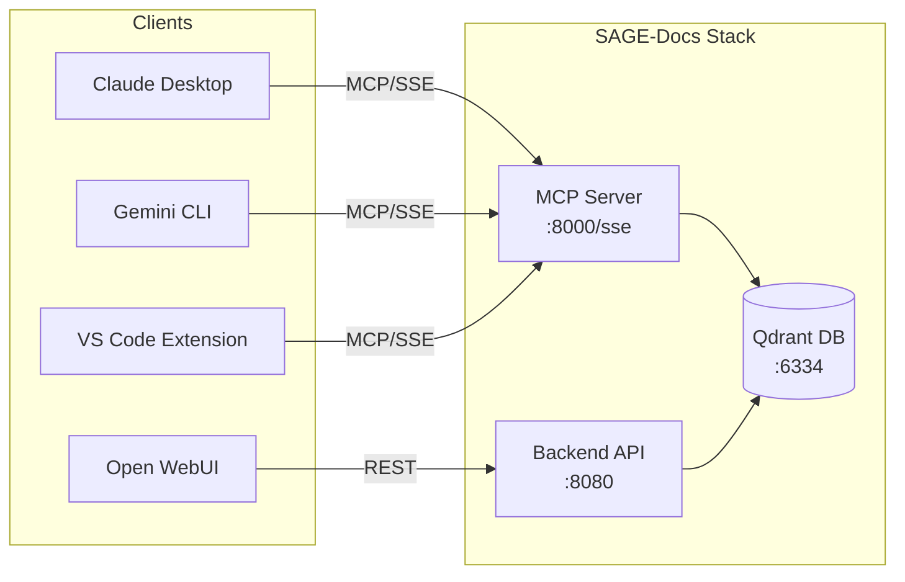
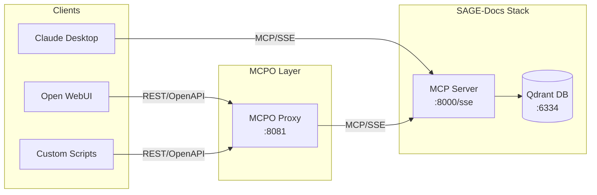
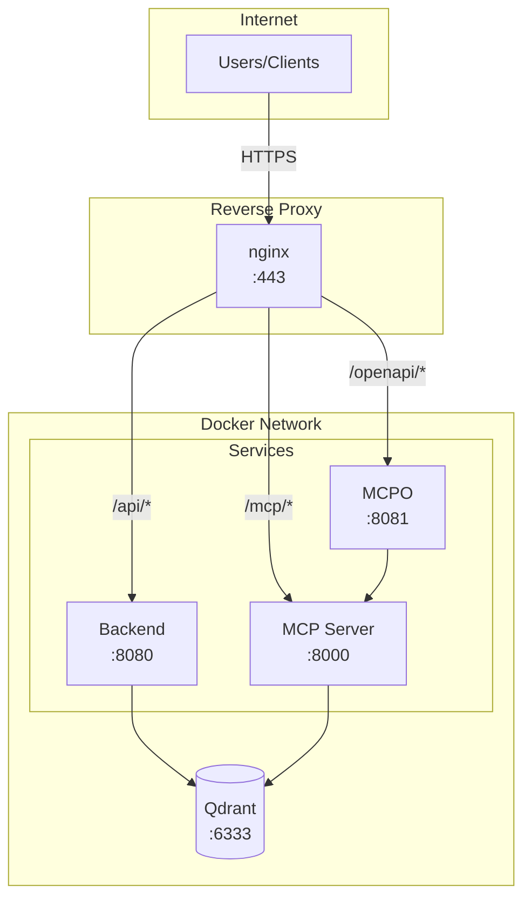

# 🌐 Integrations Guide

Connect SAGE-Docs to remote clients, Open WebUI, and production environments.

---

## 🌍 Network Accessibility

### Default Binding Behavior

When running with HTTP transport, SAGE-Docs MCP server binds to **`0.0.0.0:8000`**, making it accessible from:
- Local machine (`localhost`)
- Other containers on the same Docker network
- Remote machines on your network

| Transport | Binding | Accessible From |
|-----------|---------|-----------------|
| `stdio` | N/A (pipes) | Same process only |
| `http` | `0.0.0.0:8000` | Local + Remote |

### Remote Connection

To connect from a remote machine, replace `localhost` with your server's IP address or hostname:

```json
{
  "mcpServers": {
    "sage-docs": {
      "url": "http://192.168.1.100:8000/sse"
    }
  }
}
```

> [!TIP]
> Use `hostname -I` or `ip addr` on Linux to find your server's IP address.

### Docker Network Access

If running in Docker, use the container name for inter-container communication:

```json
{
  "mcpServers": {
    "sage-docs": {
      "url": "http://sage-docs-mcp:8000/sse"
    }
  }
}
```

---

## 🖥️ Open WebUI Integration

SAGE-Docs can integrate with [Open WebUI](https://openwebui.com/) through several methods.

### Option 1: Direct SSE Connection

SAGE-Docs uses FastMCP's built-in SSE transport, which Open WebUI can connect to directly if it supports MCP/SSE.

**Configuration:**
```json
{
  "mcpServers": {
    "sage-docs": {
      "url": "http://sage-docs-mcp:8000/sse"
    }
  }
}
```

> [!NOTE]
> Direct SSE requires Open WebUI to have native MCP client support. If not available, use the MCPO proxy below.

### Option 2: MCPO Proxy (OpenAPI Compatibility)

[MCPO](https://github.com/open-webui/mcpo) (MCP-to-OpenAPI) is a proxy that exposes MCP tools as a standard REST API with OpenAPI documentation.

#### Installation

```bash
# Install via pip
pip install mcpo

# Or using pipx for isolated installation
pipx install mcpo
```

#### Running MCPO

**Proxying to HTTP/SSE server:**
```bash
mcpo --port 8080 --proxy-url http://localhost:8000/sse
```

**Proxying to stdio server:**
```bash
mcpo --port 8080 -- python mcp-server/main.py
```

#### Configuration for Open WebUI

Once MCPO is running, Open WebUI can use it as a standard tool server:

| Setting | Value |
|---------|-------|
| **Tool URL** | `http://localhost:8080` |
| **API Docs** | `http://localhost:8080/docs` (Swagger UI) |
| **OpenAPI Spec** | `http://localhost:8080/openapi.json` |

### Option 3: Docker Compose Production Deployment

Add MCPO as a service alongside SAGE-Docs for production deployments:

```yaml
services:
  # ... existing services (qdrant, backend, mcp-server) ...

  mcpo:
    image: python:3.11-slim
    container_name: sage-docs-mcpo
    depends_on:
      - mcp-server
    ports:
      - "8081:8080"
    working_dir: /app
    command: >
      bash -c "pip install mcpo && 
               mcpo --host 0.0.0.0 --port 8080 --proxy-url http://mcp-server:8000/sse"
    restart: unless-stopped
    networks:
      - default
```

> [!TIP]
> For a more optimized image, build a custom Dockerfile:
> 
> ```dockerfile
> FROM python:3.11-slim
> RUN pip install --no-cache-dir mcpo
> EXPOSE 8080
> ENTRYPOINT ["mcpo", "--host", "0.0.0.0", "--port", "8080"]
> ```

#### Alternative: MCPO with stdio Transport

For better isolation, run the MCP server inside MCPO's subprocess:

```yaml
  mcpo:
    build: ./mcp-server
    container_name: sage-docs-mcpo
    depends_on:
      - qdrant
    ports:
      - "8081:8080"
    environment:
      - QDRANT_HOST=qdrant
      - QDRANT_PORT=6333
      - COLLECTION_NAME=sage_docs
    command: >
      bash -c "pip install mcpo && 
               mcpo --host 0.0.0.0 --port 8080 -- python main.py"
    restart: unless-stopped
```

---

## 🤖 MCP Client Configurations

### Gemini CLI

#### HTTP/SSE Transport (Recommended for Docker)

Add to `~/.gemini/settings.json` or `~/.config/gemini/settings.json`:

```json
{
  "mcpServers": {
    "sage-docs": {
      "url": "http://localhost:8000/sse"
    }
  }
}
```

#### stdio Transport (Local Development)

For running without Docker, use stdio transport:

```json
{
  "mcpServers": {
    "sage-docs": {
      "command": "python",
      "args": ["/path/to/SAGE/mcp-server/main.py"],
      "env": {
        "QDRANT_HOST": "localhost",
        "QDRANT_PORT": "6334",
        "COLLECTION_NAME": "sage_docs"
      }
    }
  }
}
```

### Claude Desktop

Add to your Claude Desktop config file:

| OS | Path |
|----|------|
| macOS | `~/Library/Application Support/Claude/claude_desktop_config.json` |
| Windows | `%APPDATA%\Claude\claude_desktop_config.json` |
| Linux | `~/.config/Claude/claude_desktop_config.json` |

```json
{
  "mcpServers": {
    "sage-docs": {
      "url": "http://localhost:8000/sse"
    }
  }
}
```

### VS Code Extensions (Cline, Continue, etc.)

Most VS Code MCP extensions support the same configuration format:

```json
{
  "mcpServers": {
    "sage-docs": {
      "url": "http://localhost:8000/sse"
    }
  }
}
```

> [!NOTE]
> Check your extension's documentation for the exact config file location. Common paths include `.vscode/mcp.json` or the extension's global storage.

### Local Development (stdio)

For development without Docker, run the MCP server directly:

```bash
# Start Qdrant locally first
docker run -p 6333:6333 qdrant/qdrant

# Run MCP server in stdio mode (default)
cd mcp-server
pip install -r requirements.txt
python main.py
```

Configure your client for stdio:

```json
{
  "mcpServers": {
    "sage-docs": {
      "command": "python",
      "args": ["main.py"],
      "cwd": "/home/user/SAGE/mcp-server",
      "env": {
        "QDRANT_HOST": "localhost",
        "QDRANT_PORT": "6333"
      }
    }
  }
}
```

---

## 🏗️ Architecture Diagram

### Basic Setup



### With MCPO Proxy



### Full Production Architecture



---

## 🔒 Security Considerations

### Authentication Recommendations

The MCP server does not include built-in authentication. For production deployments:

> [!WARNING]
> Never expose the MCP server directly to the internet without authentication!

#### Option 1: Reverse Proxy with Basic Auth

```nginx
# /etc/nginx/sites-available/sage-docs
upstream mcp_server {
    server 127.0.0.1:8000;
}

server {
    listen 443 ssl;
    server_name sage-docs.example.com;

    ssl_certificate /etc/letsencrypt/live/sage-docs.example.com/fullchain.pem;
    ssl_certificate_key /etc/letsencrypt/live/sage-docs.example.com/privkey.pem;

    # MCP Server (SSE endpoint)
    location /sse {
        auth_basic "SAGE-Docs MCP";
        auth_basic_user_file /etc/nginx/.htpasswd;

        proxy_pass http://mcp_server/sse;
        proxy_http_version 1.1;
        proxy_set_header Connection "";
        proxy_set_header Host $host;
        proxy_buffering off;
        proxy_cache off;
        
        # SSE-specific settings
        proxy_read_timeout 86400;
        proxy_set_header X-Real-IP $remote_addr;
    }

    # Backend API
    location /api/ {
        auth_basic "SAGE-Docs API";
        auth_basic_user_file /etc/nginx/.htpasswd;

        proxy_pass http://127.0.0.1:8080/api/;
        proxy_set_header Host $host;
        proxy_set_header X-Real-IP $remote_addr;
    }

    # Dashboard (public or authenticated)
    location / {
        proxy_pass http://127.0.0.1:8080/;
        proxy_set_header Host $host;
    }
}
```

Create the password file:
```bash
sudo htpasswd -c /etc/nginx/.htpasswd sage-user
```

#### Option 2: API Key Middleware

For programmatic access, implement API key validation. Add a custom middleware wrapper:

```python
# api_key_middleware.py
import os
from starlette.middleware.base import BaseHTTPMiddleware
from starlette.responses import JSONResponse

API_KEY = os.getenv("MCP_API_KEY")

class APIKeyMiddleware(BaseHTTPMiddleware):
    async def dispatch(self, request, call_next):
        if API_KEY:
            key = request.headers.get("X-API-Key")
            if key != API_KEY:
                return JSONResponse(
                    {"error": "Invalid API key"},
                    status_code=401
                )
        return await call_next(request)
```

#### Option 3: VPN/Tailscale

For team environments, use a VPN or [Tailscale](https://tailscale.com/) to restrict access:

```bash
# Install Tailscale
curl -fsSL https://tailscale.com/install.sh | sh
sudo tailscale up

# Access via Tailscale IP
# http://100.x.x.x:8000/sse
```

### Firewall Configuration

Block external access to internal ports:

```bash
# Allow only localhost and Docker network
sudo ufw default deny incoming
sudo ufw allow from 172.16.0.0/12 to any port 6333  # Qdrant
sudo ufw allow from 127.0.0.1 to any port 8000      # MCP
sudo ufw allow 443/tcp                               # HTTPS only
sudo ufw enable
```

### Docker Network Isolation

By default, Docker Compose creates an isolated network. Ensure services only expose necessary ports:

```yaml
services:
  qdrant:
    # NO ports exposed to host - internal only
    expose:
      - "6333"
  
  mcp-server:
    ports:
      - "127.0.0.1:8000:8000"  # Localhost only
```

---

## 🔧 Troubleshooting

### Connection Refused

**Symptoms:**
- `curl: (7) Failed to connect to localhost port 8000: Connection refused`
- Client shows "Failed to connect to MCP server"

**Solutions:**

1. **Verify services are running:**
   ```bash
   docker-compose ps
   ```
   
   All services should show `Up`:
   | Name | Status |
   |------|--------|
   | sage-docs-qdrant | Up |
   | sage-docs-backend | Up |
   | sage-docs-mcp | Up |

2. **Check MCP server logs:**
   ```bash
   docker-compose logs mcp-server
   ```
   
   Look for: `Starting SAGE-Docs MCP server on HTTP port 8000`

3. **Test the endpoint directly:**
   ```bash
   curl -N http://localhost:8000/sse
   ```
   
   Expected: Connection stays open (SSE stream)

4. **Port conflicts:**
   ```bash
   sudo lsof -i :8000
   ```

### Tools Not Appearing

**Symptoms:**
- Connected to MCP server but no tools show up
- "No tools available" message

**Solutions:**

1. **Check JSON syntax in config:**
   ```bash
   # Validate JSON
   cat ~/.gemini/settings.json | python -m json.tool
   ```

2. **Verify exact URL format:**
   - ✅ Correct: `http://localhost:8000/sse`
   - ❌ Wrong: `http://localhost:8000` (missing `/sse`)
   - ❌ Wrong: `localhost:8000/sse` (missing protocol)

3. **Reload/restart your client** after config changes

4. **Check Qdrant connection:**
   ```bash
   docker-compose logs mcp-server | grep -i qdrant
   ```

### MCPO Connectivity Problems

**Symptoms:**
- MCPO starts but can't reach MCP server
- `Connection refused` from MCPO to MCP

**Solutions:**

1. **Verify network connectivity (Docker):**
   ```bash
   docker exec sage-docs-mcpo ping mcp-server
   ```

2. **Check MCPO startup logs:**
   ```bash
   docker-compose logs mcpo
   ```

3. **Use correct internal hostnames:**
   - Inside Docker: `http://mcp-server:8000/sse`
   - From host: `http://localhost:8000/sse`

4. **Wait for MCP server readiness:**
   ```yaml
   mcpo:
     depends_on:
       mcp-server:
         condition: service_healthy
   ```

### Slow Initial Responses

**Symptoms:**
- First query takes 30+ seconds
- Timeouts on initial connection

**Solutions:**

The MCP server lazy-loads embedding models. Use `--preload` for faster first queries:

```yaml
mcp-server:
  command: ["python", "main.py", "--transport", "http", "--port", "8000", "--preload"]
```

Or modify the Dockerfile:
```dockerfile
CMD ["python", "main.py", "--transport", "http", "--port", "8000", "--preload"]
```

### SSE Stream Disconnects

**Symptoms:**
- Connection drops after ~60 seconds
- "Connection closed" errors

**Solutions:**

1. **Increase proxy timeouts** (if using nginx):
   ```nginx
   proxy_read_timeout 86400;
   proxy_connect_timeout 60;
   ```

2. **Disable buffering:**
   ```nginx
   proxy_buffering off;
   proxy_cache off;
   ```

3. **Check client keepalive settings**

---

## 🔗 Related Docs

- **[🏠 Welcome](./00-Welcome.md)** — Project overview
- **[🚀 Quick Start](./01-Quick-Start.md)** — Get running fast
- **[📖 User Guide](./02-User-Guide.md)** — Feature walkthrough
- **[🔌 MCP Configuration](./04-MCP-Configuration.md)** — Basic MCP client setup

---

> 💡 **Tip:** For enterprise deployments, consider using a service mesh like Istio for advanced traffic management and security.
